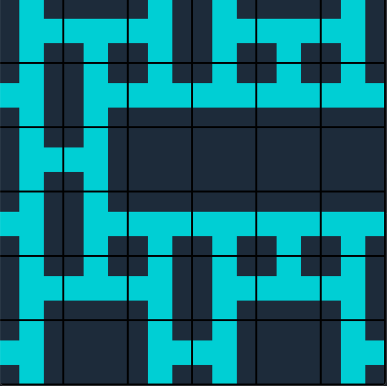

# wave-function-collapse
#### By fabaindaiz
#### Forked from [wave-function-collapse](https://github.com/fabaindaiz/wave-function-collapse)

A wave function collapse algorithm to procedurally generate tilemaps with integrated logic.

### Requirements
- python3
- pygame

### Todo
- restructure repository

## Instructions for use

### Demo

